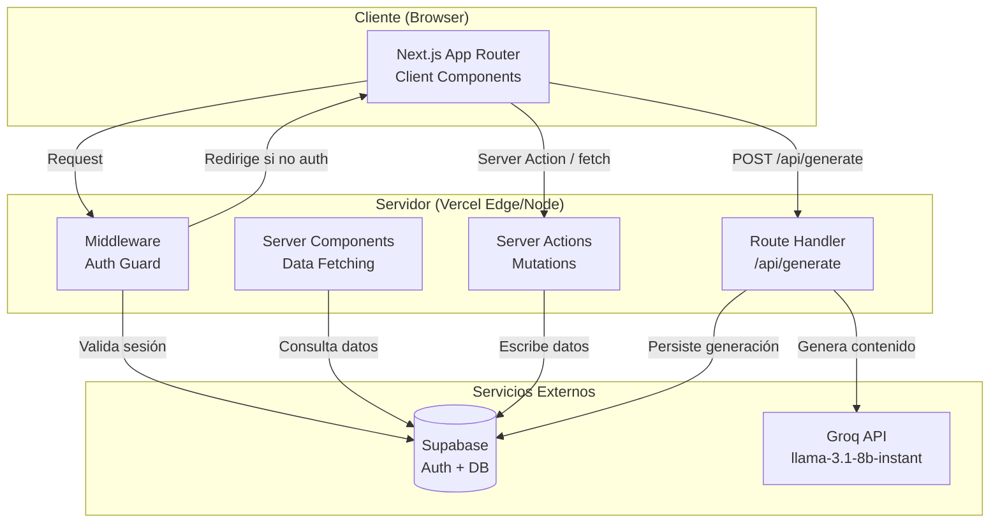
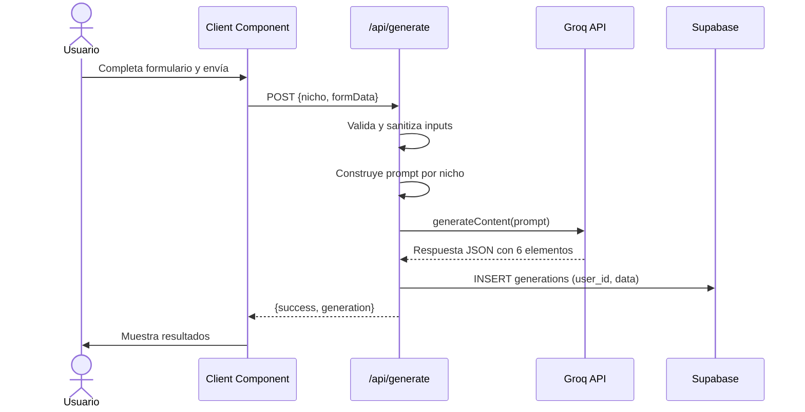

# Documento de Diseño Técnico: Creator IA LATAM

## Resumen de Investigación

Antes de escribir el diseño se investigaron las siguientes áreas:

- **Next.js 14 App Router**: Separación clara entre Server Components (RSC) y Client Components. Las rutas protegidas se manejan con middleware. Las Server Actions permiten mutaciones sin API routes explícitas.
- **Supabase Auth con Next.js**: El paquete `@supabase/ssr` es el recomendado para App Router; maneja cookies en middleware, Server Components y Client Components de forma unificada.
- **Groq API (groq-sdk)**: El SDK oficial `groq-sdk` permite llamadas rápidas a modelos open source. Para el MVP se usa `llama-3.1-8b-instant` por su velocidad y porque es completamente gratuito sin requerir tarjeta de crédito. Las llamadas deben hacerse exclusivamente desde el servidor.
- **Row Level Security (RLS)**: Las políticas RLS de Supabase se definen a nivel de tabla y se activan por defecto. El `user_id` se obtiene de `auth.uid()` en las políticas.
- **shadcn/ui + Tailwind dark mode**: shadcn/ui usa CSS variables para temas. El dark mode se configura con `class` strategy en Tailwind para control programático.

---

## Overview

Creator IA LATAM es un SaaS web que permite a pequeños negocios latinoamericanos generar contenido optimizado para redes sociales mediante IA. El usuario selecciona su nicho (6 categorías), completa un formulario con datos de su negocio y campaña, y recibe 6 piezas de contenido generadas por Groq API: post de Instagram, caption, hashtags, historia, CTA e idea de Reel.

El sistema está construido sobre Next.js 14 App Router con TypeScript, Supabase como backend (auth + base de datos), Groq API para generación de contenido (100% gratuito, sin tarjeta de crédito), y desplegado en Vercel.

### Objetivos del MVP

- Autenticación segura con Supabase Auth
- Generación de contenido especializado por nicho con prompts localizados para LATAM
- Historial persistente de generaciones por usuario
- UI moderna con dark mode, sidebar y diseño responsivo

---

## Arquitectura

### Diagrama de Alto Nivel



### Flujo de Datos Principal



### Decisiones de Arquitectura Clave

1. **Server-side Groq calls**: La API key de Groq nunca sale del servidor. El Route Handler `/api/generate` es el único punto de contacto con Groq.
2. **Server Components para historial**: El historial se renderiza como RSC para evitar waterfalls de datos en el cliente.
3. **Server Actions para auth**: Login, registro y logout usan Server Actions para mantener la lógica de auth en el servidor.
4. **Middleware para protección de rutas**: Un único middleware intercepta todas las rutas del dashboard y valida la sesión de Supabase.

---

## Componentes e Interfaces

### Estructura de Carpetas

```
src/
├── app/
│   ├── (auth)/
│   │   ├── login/
│   │   │   └── page.tsx
│   │   └── register/
│   │       └── page.tsx
│   ├── (dashboard)/
│   │   ├── layout.tsx          # Sidebar + auth guard
│   │   ├── dashboard/
│   │   │   └── page.tsx        # Home: selección de nicho + formulario
│   │   ├── generate/
│   │   │   └── page.tsx        # Resultados de generación
│   │   └── history/
│   │       └── page.tsx        # Historial (RSC)
│   ├── api/
│   │   └── generate/
│   │       └── route.ts        # Route Handler: llama a Gemini
│   ├── layout.tsx              # Root layout
│   └── page.tsx                # Landing / redirect
├── components/
│   ├── auth/
│   │   ├── LoginForm.tsx
│   │   └── RegisterForm.tsx
│   ├── dashboard/
│   │   ├── Sidebar.tsx
│   │   ├── NichoSelector.tsx
│   │   └── GeneratorForm.tsx
│   ├── generation/
│   │   ├── GenerationResult.tsx
│   │   ├── ContentCard.tsx     # Card copiable individual
│   │   └── LoadingState.tsx
│   ├── history/
│   │   ├── HistoryList.tsx
│   │   └── HistoryItem.tsx
│   └── ui/                     # shadcn/ui components
├── lib/
│   ├── supabase/
│   │   ├── client.ts           # Browser client
│   │   ├── server.ts           # Server client (cookies)
│   │   └── middleware.ts       # Middleware client
│   ├── groq/
│   │   ├── client.ts           # Groq SDK init
│   │   └── generate.ts         # generateContent wrapper
│   ├── prompts/
│   │   ├── index.ts            # buildPrompt(nicho, formData)
│   │   └── templates/
│   │       ├── odontologo.ts
│   │       ├── peluqueria.ts
│   │       ├── inmobiliaria.ts
│   │       ├── gimnasio.ts
│   │       ├── mecanico.ts
│   │       └── restaurante.ts
│   ├── validations/
│   │   └── generator.ts        # Zod schemas
│   └── utils.ts
├── actions/
│   ├── auth.ts                 # Server Actions: login, register, logout
│   └── history.ts              # Server Actions: getHistory, getGeneration
├── types/
│   └── index.ts                # Tipos compartidos
└── middleware.ts               # Auth middleware (raíz de src/)
```

### Interfaces TypeScript Principales

```typescript
// types/index.ts

export type Nicho =
  | 'odontologo'
  | 'peluqueria'
  | 'inmobiliaria'
  | 'gimnasio'
  | 'mecanico'
  | 'restaurante';

export const NICHOS_CONFIG: Record<Nicho, { label: string; emoji: string }> = {
  odontologo:   { label: 'Odontólogo',              emoji: '🦷' },
  peluqueria:   { label: 'Peluquería / Salón',       emoji: '✂️' },
  inmobiliaria: { label: 'Inmobiliaria',             emoji: '🏠' },
  gimnasio:     { label: 'Gimnasio',                 emoji: '💪' },
  mecanico:     { label: 'Mecánico',                 emoji: '🔧' },
  restaurante:  { label: 'Restaurante',              emoji: '🍽️' },
};

export type TonoComunicacion =
  | 'profesional'
  | 'amigable'
  | 'urgente'
  | 'inspirador'
  | string; // permite texto libre

export type ObjetivoPublicacion =
  | 'atraer_clientes'
  | 'promocionar_oferta'
  | 'generar_confianza'
  | 'aumentar_seguidores'
  | string; // permite texto libre

export interface FormularioGenerador {
  nombreNegocio: string;
  pais: string;
  ciudad: string;
  promocion: string;
  tono: TonoComunicacion;
  objetivo: ObjetivoPublicacion;
}

export interface GeneracionContenido {
  postInstagram: string;
  caption: string;
  hashtags: string[];
  historia: string;
  cta: string;
  reel: string;
}

export interface Generacion {
  id: string;
  userId: string;
  nicho: Nicho;
  formulario: FormularioGenerador;
  contenido: GeneracionContenido;
  createdAt: string;
}

export interface GenerateRequest {
  nicho: Nicho;
  formulario: FormularioGenerador;
}

export interface GenerateResponse {
  success: boolean;
  generation?: Generacion;
  error?: string;
}
```

### API Route: `/api/generate`

```typescript
// Contrato de la API
// POST /api/generate
// Body: GenerateRequest
// Response: GenerateResponse
// Auth: requiere sesión válida (validada en middleware)
// Timeout: 30 segundos
```

---

## Modelos de Datos

### Schema de Supabase

#### Tabla: `generations`

| Columna        | Tipo        | Restricciones                        | Descripción                          |
|----------------|-------------|--------------------------------------|--------------------------------------|
| `id`           | `uuid`      | PK, default `gen_random_uuid()`      | Identificador único                  |
| `user_id`      | `uuid`      | FK → `auth.users(id)`, NOT NULL      | Usuario propietario                  |
| `nicho`        | `text`      | NOT NULL, CHECK en enum              | Nicho seleccionado                   |
| `nombre_negocio` | `text`    | NOT NULL                             | Nombre del negocio                   |
| `pais`         | `text`      | NOT NULL                             | País del negocio                     |
| `ciudad`       | `text`      | NOT NULL                             | Ciudad del negocio                   |
| `promocion`    | `text`      | NOT NULL                             | Promoción o servicio destacado       |
| `tono`         | `text`      | NOT NULL                             | Tono de comunicación                 |
| `objetivo`     | `text`      | NOT NULL                             | Objetivo de la publicación           |
| `post_instagram` | `text`    | NOT NULL                             | Post generado para Instagram         |
| `caption`      | `text`      | NOT NULL                             | Caption generado                     |
| `hashtags`     | `text[]`    | NOT NULL                             | Array de hashtags                    |
| `historia`     | `text`      | NOT NULL                             | Idea de historia (Story)             |
| `cta`          | `text`      | NOT NULL                             | Llamada a la acción                  |
| `reel`         | `text`      | NOT NULL                             | Idea de Reel                         |
| `created_at`   | `timestamptz` | NOT NULL, default `now()`          | Fecha de creación                    |

#### SQL de Creación

```sql
-- Habilitar extensión uuid
create extension if not exists "pgcrypto";

-- Enum para nichos
create type nicho_type as enum (
  'odontologo',
  'peluqueria',
  'inmobiliaria',
  'gimnasio',
  'mecanico',
  'restaurante'
);

-- Tabla principal
create table public.generations (
  id              uuid        primary key default gen_random_uuid(),
  user_id         uuid        not null references auth.users(id) on delete cascade,
  nicho           nicho_type  not null,
  nombre_negocio  text        not null,
  pais            text        not null,
  ciudad          text        not null,
  promocion       text        not null,
  tono            text        not null,
  objetivo        text        not null,
  post_instagram  text        not null,
  caption         text        not null,
  hashtags        text[]      not null default '{}',
  historia        text        not null,
  cta             text        not null,
  reel            text        not null,
  created_at      timestamptz not null default now()
);

-- Índice para consultas por usuario ordenadas por fecha
create index idx_generations_user_created
  on public.generations (user_id, created_at desc);

-- Habilitar RLS
alter table public.generations enable row level security;

-- Política: usuarios solo ven sus propias generaciones
create policy "users_own_generations_select"
  on public.generations for select
  using (auth.uid() = user_id);

-- Política: usuarios solo insertan sus propias generaciones
create policy "users_own_generations_insert"
  on public.generations for insert
  with check (auth.uid() = user_id);

-- Política: usuarios solo eliminan sus propias generaciones
create policy "users_own_generations_delete"
  on public.generations for delete
  using (auth.uid() = user_id);
```

### Variables de Entorno

```bash
# .env.local (nunca en el cliente)
NEXT_PUBLIC_SUPABASE_URL=https://xxxx.supabase.co
NEXT_PUBLIC_SUPABASE_ANON_KEY=eyJ...          # Solo para auth en cliente
GROQ_API_KEY=gsk_...                           # Solo servidor — gratuito en console.groq.com
SUPABASE_SERVICE_ROLE_KEY=eyJ...               # Solo servidor (opcional para admin)
```

> Las variables `NEXT_PUBLIC_*` son accesibles en el cliente pero solo exponen la URL pública y la anon key de Supabase, que son seguras por diseño (protegidas por RLS). La `GROQ_API_KEY` nunca tiene prefijo `NEXT_PUBLIC_`.

### Diseño de Prompt Templates

Cada nicho tiene un template que recibe los parámetros del formulario y produce un prompt estructurado. El prompt instruye a Gemini a responder en JSON con exactamente los 6 campos requeridos.

```typescript
// lib/prompts/index.ts
export function buildPrompt(nicho: Nicho, form: FormularioGenerador): string {
  const template = templates[nicho];
  return template(form);
}

// Estructura de respuesta esperada de Groq (JSON parseado del texto)
interface GroqResponseSchema {
  post_instagram: string;   // 150-300 caracteres
  caption: string;          // 100-200 caracteres
  hashtags: string[];       // 10-15 hashtags sin #
  historia: string;         // Idea de story en 2-3 oraciones
  cta: string;              // CTA directo en 1 oración
  reel: string;             // Concepto de reel en 2-3 oraciones
}
```

**Estructura base del prompt (ejemplo Odontólogo):**

```
Eres un experto en marketing digital para negocios de salud dental en América Latina.
Genera contenido para redes sociales para el siguiente negocio:

- Negocio: {nombreNegocio}
- País: {pais}
- Ciudad: {ciudad}
- Promoción/Servicio: {promocion}
- Tono: {tono}
- Objetivo: {objetivo}

Responde ÚNICAMENTE con un JSON válido con esta estructura exacta:
{
  "post_instagram": "...",
  "caption": "...",
  "hashtags": ["hashtag1", "hashtag2", ...],
  "historia": "...",
  "cta": "...",
  "reel": "..."
}

Instrucciones:
- Todo el contenido en español latinoamericano
- Adapta el lenguaje y referencias culturales a {pais}, {ciudad}
- post_instagram: texto principal del post, 150-300 caracteres, incluye emojis relevantes
- caption: descripción más larga para el caption, 100-200 caracteres
- hashtags: 10-15 hashtags relevantes para odontología en LATAM, sin el símbolo #
- historia: idea creativa para Instagram Story, 2-3 oraciones
- cta: llamada a la acción directa y específica, 1 oración
- reel: concepto creativo para Reel de 15-30 segundos, 2-3 oraciones
```

---

## Propiedades de Corrección

*Una propiedad es una característica o comportamiento que debe mantenerse verdadero en todas las ejecuciones válidas de un sistema — esencialmente, una declaración formal sobre lo que el sistema debe hacer. Las propiedades sirven como puente entre las especificaciones legibles por humanos y las garantías de corrección verificables por máquinas.*

---

### Propiedad 1: Credenciales válidas producen sesión autenticada

*Para cualquier* par de credenciales (email, contraseña) que correspondan a un usuario registrado en el sistema, el proceso de login debe producir una sesión activa y redirigir al Dashboard.

**Valida: Requisito 1.2**

---

### Propiedad 2: Credenciales inválidas son rechazadas sin revelar información sensible

*Para cualquier* par de credenciales que no correspondan a un usuario registrado, el sistema debe rechazar el intento de login mostrando un mensaje de error genérico que no revele si el email existe o no.

**Valida: Requisito 1.3**

---

### Propiedad 3: Rutas del dashboard requieren autenticación

*Para cualquier* ruta dentro del grupo `(dashboard)`, una solicitud sin sesión válida debe resultar en una redirección a la página de login, nunca en mostrar contenido protegido.

**Valida: Requisito 1.4**

---

### Propiedad 4: Logout invalida la sesión activa

*Para cualquier* usuario autenticado, ejecutar logout debe resultar en que la sesión quede inválida, de modo que un intento posterior de acceder al dashboard sea redirigido al login.

**Valida: Requisito 1.5**

---

### Propiedad 5: Cambio de nicho limpia el formulario

*Para cualquier* par de nichos distintos (A, B), si el usuario tiene el nicho A seleccionado con datos en el formulario y cambia al nicho B, todos los campos del formulario deben quedar vacíos.

**Valida: Requisito 2.4**

---

### Propiedad 6: Formulario con campos vacíos es rechazado

*Para cualquier* subconjunto no vacío de campos obligatorios del formulario que estén vacíos o contengan solo espacios en blanco, el intento de envío debe ser rechazado con mensajes de validación específicos por campo, sin enviar la solicitud al Motor IA.

**Valida: Requisito 3.2**

---

### Propiedad 7: Formulario completo habilita el botón de generación

*Para cualquier* combinación de valores válidos (no vacíos) en los 6 campos obligatorios del formulario, el botón de generación debe estar habilitado.

**Valida: Requisito 3.5**

---

### Propiedad 8: El prompt construido contiene los datos del formulario y localización

*Para cualquier* nicho y cualquier conjunto de datos del formulario (nombreNegocio, pais, ciudad, promocion, tono, objetivo), el prompt construido por `buildPrompt` debe contener: los valores de país y ciudad del formulario, instrucciones en español latinoamericano, y contenido específico del nicho seleccionado.

**Valida: Requisitos 4.1, 4.3, 4.6**

---

### Propiedad 9: Toda generación exitosa contiene exactamente 6 elementos de contenido

*Para cualquier* solicitud de generación válida (nicho + formulario completo), la respuesta del Motor IA debe contener exactamente los 6 elementos: `post_instagram`, `caption`, `hashtags`, `historia`, `cta` y `reel`, todos con valores no vacíos.

**Valida: Requisito 4.2**

---

### Propiedad 10: Los resultados de generación se renderizan con los 6 elementos

*Para cualquier* objeto `GeneracionContenido` válido, el componente `GenerationResult` debe renderizar los 6 elementos de contenido en secciones diferenciadas, cada una con un mecanismo de copia individual.

**Valida: Requisito 4.7**

---

### Propiedad 11: Toda generación exitosa es persistida en Supabase

*Para cualquier* generación completada exitosamente, al consultar la tabla `generations` con el `user_id` del usuario autenticado, debe existir un registro con los datos de esa generación.

**Valida: Requisito 5.1**

---

### Propiedad 12: El historial muestra solo las generaciones del usuario autenticado

*Para cualquier* par de usuarios distintos (A, B), las generaciones creadas por el usuario A no deben aparecer en las consultas del historial del usuario B, y viceversa.

**Valida: Requisitos 5.2, 7.2**

---

### Propiedad 13: El historial está ordenado por fecha descendente

*Para cualquier* conjunto de generaciones de un usuario, al recuperar el historial, las generaciones deben estar ordenadas de más reciente a más antigua (por `created_at` descendente).

**Valida: Requisito 5.3**

---

### Propiedad 14: Cada entrada del historial muestra los campos requeridos

*Para cualquier* generación en el historial, el componente `HistoryItem` debe renderizar: nombre del negocio, nicho, fecha de creación y una vista previa del post de Instagram. Al seleccionar la entrada, deben mostrarse los 6 elementos completos.

**Valida: Requisitos 5.4, 5.5**

---

### Propiedad 15: Los inputs del servidor son validados antes de construir el prompt

*Para cualquier* input enviado al Route Handler `/api/generate`, incluyendo strings con caracteres especiales, HTML, o scripts, el servidor debe sanitizar y validar los datos antes de pasarlos a `buildPrompt`, rechazando inputs que no cumplan el schema Zod.

**Valida: Requisito 7.3**

---

## Manejo de Errores

### Estrategia General

Todos los errores se manejan en capas, sin interrumpir la navegación del usuario:

| Capa | Mecanismo | Comportamiento |
|------|-----------|----------------|
| Middleware | `try/catch` en validación de sesión | Redirige a login si falla |
| Server Actions | `try/catch` + return `{error: string}` | Devuelve error al cliente |
| Route Handler `/api/generate` | `try/catch` + HTTP status codes | 400 (validación), 408 (timeout), 500 (Groq error) |
| Client Components | Estado de error local + toast/alert | Muestra mensaje contextual |

### Casos de Error Específicos

**Autenticación (Requisito 1.6)**
```typescript
// Si Supabase no responde, la Server Action devuelve:
{ error: "El servicio no está disponible temporalmente. Intenta de nuevo en unos minutos." }
```

**Timeout de Groq (Requisito 4.5)**
```typescript
// AbortController con 30 segundos
const controller = new AbortController();
const timeout = setTimeout(() => controller.abort(), 30_000);
// Si se agota: HTTP 408 + mensaje de reintento
```

**Validación de formulario (Requisito 3.2)**
```typescript
// Zod schema en servidor + react-hook-form en cliente
// Errores por campo: { nombreNegocio: "El nombre del negocio es requerido" }
```

**Historial vacío (Requisito 5.6)**
```typescript
// El componente HistoryList verifica si generations.length === 0
// Muestra EmptyState con enlace al formulario generador
```

---

## Estrategia de Testing

### Enfoque Dual: Unit Tests + Property-Based Tests

Ambos tipos son complementarios y necesarios para cobertura completa:

- **Unit tests**: verifican ejemplos específicos, casos borde y condiciones de error
- **Property tests**: verifican propiedades universales sobre rangos de inputs

### Herramientas

| Tipo | Librería | Configuración |
|------|----------|---------------|
| Unit tests | **Vitest** + **React Testing Library** | `vitest.config.ts` |
| Property tests | **fast-check** | Mínimo 100 iteraciones por propiedad |
| Mocks de Supabase | `vitest` mocks | Mock del cliente Supabase |
| Mocks de Groq | `vitest` mocks | Mock de `generateContent` |

### Unit Tests (ejemplos específicos y casos borde)

```
tests/unit/
├── auth/
│   ├── login.test.ts           # Req 1.1, 1.2, 1.3 - ejemplos concretos
│   └── logout.test.ts          # Req 1.5 - ejemplo concreto
├── components/
│   ├── NichoSelector.test.tsx  # Req 2.1 - exactamente 6 nichos
│   ├── GeneratorForm.test.tsx  # Req 3.1, 3.3, 3.4 - campos y opciones
│   ├── GenerationResult.test.tsx # Req 4.7 - renderizado de 6 elementos
│   └── HistoryList.test.tsx    # Req 5.6 - estado vacío
├── api/
│   └── generate.test.ts        # Req 4.5 - timeout de Groq (edge case)
└── security/
    └── env.test.ts             # Req 7.1 - API key no expuesta en cliente
```

### Property-Based Tests

```
tests/properties/
├── auth.property.test.ts
├── form.property.test.ts
├── prompts.property.test.ts
├── generation.property.test.ts
├── history.property.test.ts
└── validation.property.test.ts
```

**Configuración de fast-check:**
```typescript
// vitest.config.ts
import { defineConfig } from 'vitest/config';
export default defineConfig({
  test: {
    globals: true,
    environment: 'jsdom',
  },
});

// En cada property test:
import fc from 'fast-check';
fc.configureGlobal({ numRuns: 100 });
```

**Ejemplos de property tests:**

```typescript
// Feature: creator-ia-latam, Property 8: El prompt construido contiene los datos del formulario
it('Property 8: buildPrompt incluye país, ciudad e instrucciones en español para cualquier nicho', () => {
  fc.assert(
    fc.property(
      fc.constantFrom(...NICHOS),
      fc.record({
        nombreNegocio: fc.string({ minLength: 1 }),
        pais: fc.string({ minLength: 1 }),
        ciudad: fc.string({ minLength: 1 }),
        promocion: fc.string({ minLength: 1 }),
        tono: fc.string({ minLength: 1 }),
        objetivo: fc.string({ minLength: 1 }),
      }),
      (nicho, form) => {
        const prompt = buildPrompt(nicho, form);
        expect(prompt).toContain(form.pais);
        expect(prompt).toContain(form.ciudad);
        expect(prompt.toLowerCase()).toContain('español');
      }
    )
  );
});

// Feature: creator-ia-latam, Property 6: Formulario con campos vacíos es rechazado
it('Property 6: validación rechaza cualquier combinación de campos vacíos', () => {
  fc.assert(
    fc.property(
      fc.record({
        nombreNegocio: fc.oneof(fc.constant(''), fc.string()),
        pais: fc.oneof(fc.constant(''), fc.string()),
        ciudad: fc.oneof(fc.constant(''), fc.string()),
        promocion: fc.oneof(fc.constant(''), fc.string()),
        tono: fc.oneof(fc.constant(''), fc.string()),
        objetivo: fc.oneof(fc.constant(''), fc.string()),
      }).filter(form => Object.values(form).some(v => v.trim() === '')),
      (form) => {
        const result = generatorSchema.safeParse(form);
        expect(result.success).toBe(false);
      }
    )
  );
});

// Feature: creator-ia-latam, Property 13: Historial ordenado por fecha descendente
it('Property 13: getHistory devuelve generaciones ordenadas por fecha descendente', () => {
  fc.assert(
    fc.property(
      fc.array(fc.record({ created_at: fc.date() }), { minLength: 2 }),
      (generations) => {
        const sorted = sortByDateDesc(generations);
        for (let i = 0; i < sorted.length - 1; i++) {
          expect(new Date(sorted[i].created_at) >= new Date(sorted[i + 1].created_at)).toBe(true);
        }
      }
    )
  );
});
```

### Cobertura Objetivo

| Área | Unit Tests | Property Tests |
|------|-----------|----------------|
| Auth flows | ✅ | ✅ Props 1-4 |
| Nicho selector | ✅ | ✅ Prop 5 |
| Form validation | ✅ | ✅ Props 6-7 |
| Prompt building | ✅ | ✅ Props 8-9 |
| Generation rendering | ✅ | ✅ Prop 10 |
| History persistence | ✅ | ✅ Props 11-14 |
| Server validation | ✅ | ✅ Prop 15 |
